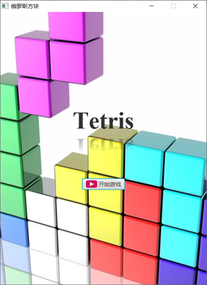
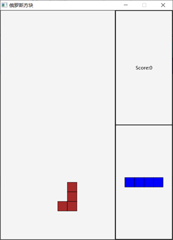
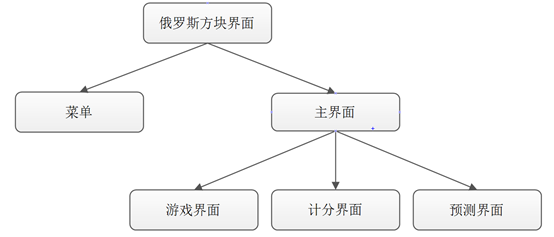

# Java傻瓜式俄罗斯方块
大二上刚学java的时候写的一个小项目，完全基于javafx，特别特别傻瓜的实现方式，纯新手稍微了解点基础语法也看得懂

## 效果

## 涉及知识
### 多线程
  除了主线程监控一些事件、检测是否达到消除方块的条件，方块的下降单独作为一个线程
### javafx
  全部的图形界面都是用javafx搭建的，不熟悉javafx的同学可以稍微参考一下

## 运行
  把整个文件夹在IDE中以项目形式打开，如果jdk什么的已经安装好了，就可以直接运行。

## 组织

1. 菜单

2. 主界面

+ 游戏界面

+ 计分界面

+ 预测界面

